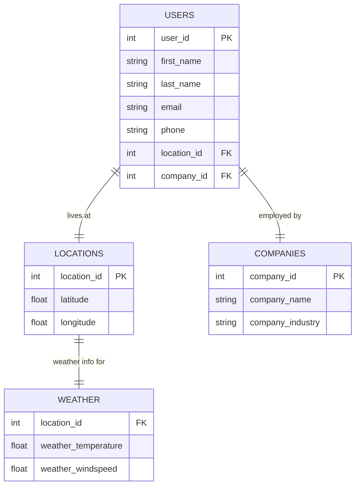

# Entity-Relationship Diagram (ERD)

The following diagram represents the normalized schema in DuckDB with [Mermaid](https://mermaid.js.org/syntax/entityRelationshipDiagram.html) code:

I pasted this code into the [Mermaid Live Editor](https://mermaid.live/) and then exported the diagram as an image that I saved in the same directory as this file.