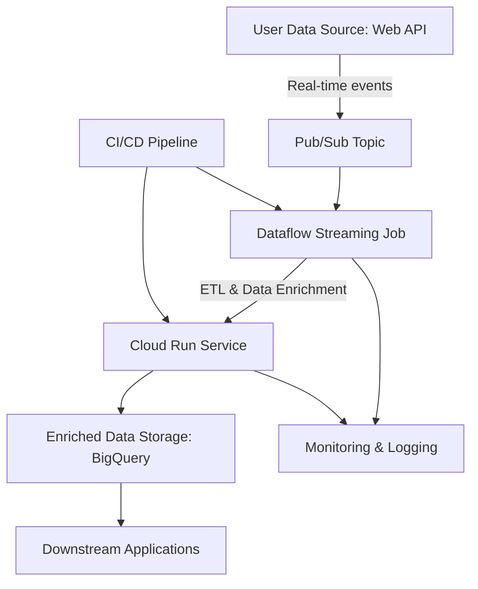
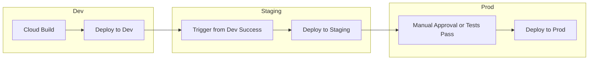

# Real-Time Production Architecture on GCP

## Overview

This design document outlines a cloud-native architecture for real-time ingestion and delivery of user-weather data to downstream applications. The architecture prioritizes low-latency ingestion, high availability, scalability, and fault tolerance while maintaining cost-efficiency and operational simplicity through serverless and managed GCP services.

## Architecture Diagram

## Environment Dev/Staging/Prod Flow

## Component Details

### Pub/Sub
- **Role**: Acts as a highly available, low-latency ingestion endpoint for incoming user data events.
- **Rationale**: Provides decoupling between data producers and consumers, ensuring that transient failures do not affect overall throughput.
- **Documentation**: [Google Cloud Pub/Sub Documentation](https://cloud.google.com/pubsub/docs)

### Dataflow
- **Role**: Processes streaming data from Pub/Sub, performs transformations, enrichments (e.g., joining with weather data from a REST API), and error handling.
- **Rationale**: Scales automatically to handle bursts in data, provides exactly-once processing semantics, and offers robust fault tolerance.
- **Note**: Uses Apache Beam SDKs to allow for unified batch and stream pipelines.
- **Documentation**: [Google Cloud Dataflow Documentation](https://cloud.google.com/dataflow/docs)

### Cloud Run
- **Role**: Hosts containerized microservices for additional transformations or to serve enriched data.
- **Rationale**: Enables auto-scaling, cost-effective serverless execution, and easy integration with other GCP services.
- **Documentation**: [Google Cloud Run Documentation](https://cloud.google.com/run/docs)

### BigQuery
- **Role**: Serves as the analytical data store for enriched user-weather records.
- **Rationale**: Provides fast query performance, supports SQL for ad-hoc queries, and integrates seamlessly with visualization tools.
- **Note**: Separates storage and compute for scalability and cost control. 
- **Documentation**: [Google Cloud BigQuery Documentation](https://cloud.google.com/bigquery/docs)

### Downstream Applications
- **Role**: Consume the enriched data for dashboards, reporting, or operational tasks.
- **Rationale**: Real-time access to data enables timely insights and operational responsiveness. 
- **Examples**:
  - Visualization: [Google Looker Studio](https://lookerstudio.google.com/u/0/navigation/reporting)
  - Reverse ETL: Operational sync with downstream systems and tools via REST or event triggers.

### Monitoring & Logging
- **Role**: Observability for pipeline health, latency, throughput, and failure rates.
- **Components**:
  - Cloud Monitoring for metrics and alerts
  - Cloud Logging for structured logs from Dataflow and Cloud Run
  - Cloud Trace/Profiler for performance diagnostics
- **Documentation**: [Operations Suite Overview](https://cloud.google.com/products/operations)

### CI/CD Pipeline
- **Role**: Automates the build, test, and deployment lifecycle for streaming jobs and microservices.
- **Components**:
  - **[Cloud Build](https://cloud.google.com/build/docs) / [GitHub Actions](https://docs.github.com/en/actions)**: Triggered on merge to main for deploying Dataflow templates and Cloud Run containers.
  - **[Artifact Registry](https://cloud.google.com/artifact-registry/docs)**: Stores Docker images and pipeline artifacts.
  - **IaC Integration**: [Terraform](https://registry.terraform.io/providers/hashicorp/google/latest/docs) or [Deployment Manager](https://cloud.google.com/deployment-manager/docs) scripts ensure consistent environment provisioning.
  - **Secrets Management**: Leverage [Secret Manager](https://cloud.google.com/secret-manager/docs) for API keys and credentials.
- **Benefits**:
  - Ensures repeatable deployments and fast rollback
  - Encourages testing and validation pre-deployment

## Design Considerations

- **Low-latency ingestion**: Pub/Sub ensures data is immediately available for downstream processing.

- **High-availability & Fault Tolerance**:
  - Dataflow handles failures with retries and supports stateful processing.
  - Cloud Run provides auto-scaling and restarts failed containers as needed.

- **Scalability**: Components scale independently; Dataflow and Pub/Sub handle dynamic loads automatically.

- **Cost Efficiency**:
  - Serverless components (Cloud Run, Dataflow, Pub/Sub) are billed based on actual usage.

- **Security**:
  - Use IAM roles to control access to each component.
  - Encrypt data in transit and at rest with GCP-managed keys.

- **Monitoring & Observability**:
  - Alerts and dashboards help maintain SLAs.
  - Logs and traces allow for root cause analysis of data pipeline issues.

- **Data Governance & Compliance**:
  - Define retention policies for BigQuery.
  - Log data access and use Data Loss Prevention API for sensitive fields if needed.

- **Deployment Pipelines**:
  - Use CI/CD tooling to manage releases across environments (dev/staging/prod).
  - Automate testing of streaming pipelines before promotion.

## Conclusion

This architecture is robust, scalable, and well-suited for real-time enrichment workloads. It leverages managed and serverless GCP services to reduce operational overhead while delivering low-latency insights and operational flexibility. Integration with observability, security, governance, and CI/CD best practices ensures it’s ready for production use.