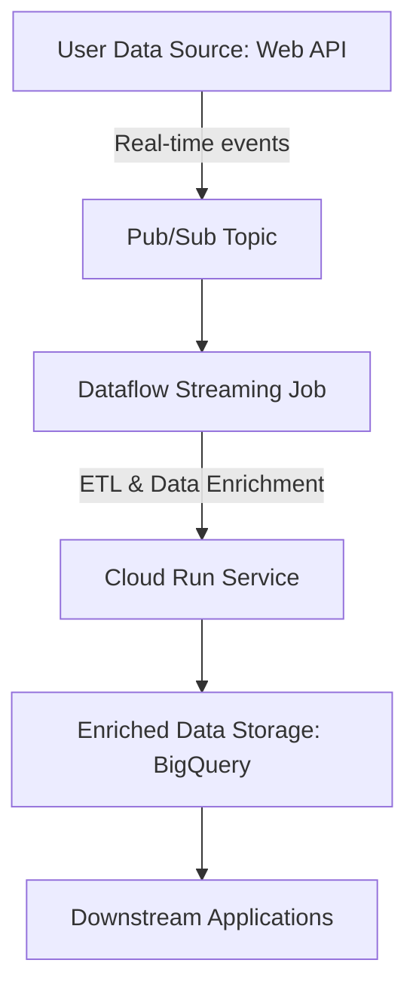

# Real-Time Production Architecture on GCP

## Overview

This design document outlines a cloud-native architecture for real-time ingestion and delivery of user-weather data to downstream applications. The architecture prioritizes low-latency ingestion, high availability, and fault tolerance.

## Architecture Diagram

I pasted this code into the [Mermaid Live Editor](https://mermaid.live/) and then exported the diagram as an image that I saved in the same directory as this file.

## Component Details
	•	Pub/Sub:
	    •	Role: Acts as a highly available, low-latency ingestion endpoint for incoming user data events.
	    •	Rationale: Provides decoupling between data producers and consumers, ensuring that transient failures do not affect overall throughput.
        •	Documentation: [Google Cloud Pub/Sub Documentation](https://cloud.google.com/pubsub/docs)

	•	Dataflow:
	    •	Role: Processes streaming data from Pub/Sub, performs transformations, enrichments (e.g., joining with weather data from a REST API) and error handling.
	    •	Rationale: Scales automatically to handle bursts in data, provides exactly-once processing semantics, and offers robust fault tolerance.
        •	Documentation: [Google Cloud Dataflow Documentation](https://cloud.google.com/dataflow/docs)

	•	Cloud Run:
	    •	Role: Hosts containerized microservices for additional transformations or to serve enriched data.
	    •	Rationale: Enables auto-scaling, cost-effective serverless execution, and easy integration with other GCP services.
        •	Documentation: [Google Cloud Run Documentation](https://cloud.google.com/run/docs)

	•	BigQuery:
	    •	Role: Serves as the analytical data store for enriched user-weather records.
	    •	Rationale: Provides fast query performance, supports SQL for ad-hoc queries, and integrates seamlessly with visualization tools.
        •	Documentation: [Google Cloud BigQuery Documentation](https://cloud.google.com/bigquery/docs)

	•	Downstream Applications:
	    •	Role: Consume the enriched data for dashboards, reporting, or operational tasks.
	    •	Rationale: Real-time access to data enables timely insights and operational responsiveness. I think we will continue to see an increase of streaming use cases in data engineering in the future. There are services with GCP like [Google Data Studio](https://lookerstudio.google.com/u/0/navigation/reporting) or various open-source alternatives available for dashboarding and visualization. For Reverse-ETL or operational tasks, designing pipelines is very dependent on what the downstream system or use case is.

## Design Considerations
	•	Low-latency ingestion: Pub/Sub ensures data is immediately available for downstream processing.
	•	High-availability & Fault Tolerance:
	    •	Dataflow’s managed service handles failures gracefully with built-in retries and stateful processing.
	    •	Cloud Run’s auto-scaling and containerization ensure that processing is resilient.
	•	Scalability: Each component scales independently; Dataflow and Pub/Sub automatically handle increasing loads.
	•	Cost Efficiency: Serverless services (Cloud Run, Dataflow, Pub/Sub) reduce operational overhead and cost when idle.

This design provides a robust and scalable solution for real-time data ingestion and enrichment.