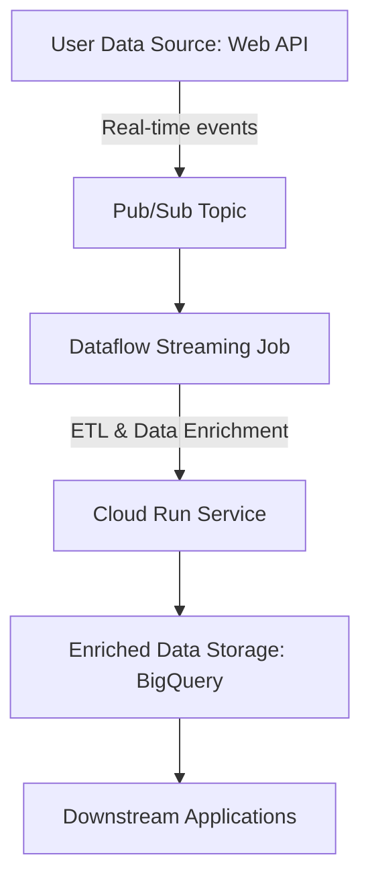

# Real-Time Production Architecture on GCP

## Overview

This design document outlines a cloud-native architecture for real-time ingestion and delivery of user-weather data to downstream applications. The architecture prioritizes low-latency ingestion, high availability, and fault tolerance.

## Architecture Diagram

I pasted this code into the [Mermaid Live Editor](https://mermaid.live/) and then exported the diagram as an image that I saved in the same directory as this file.